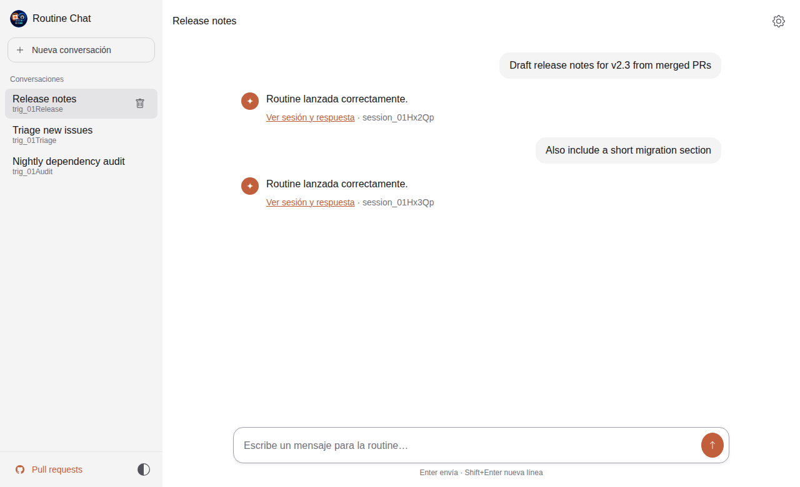
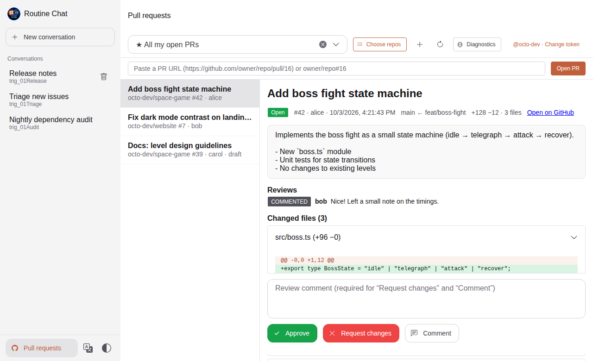
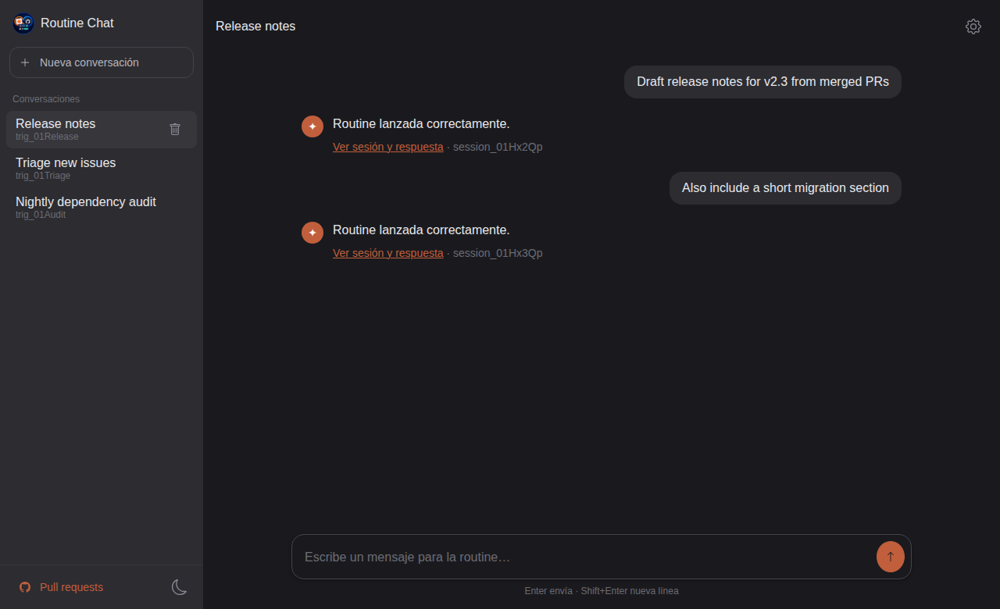
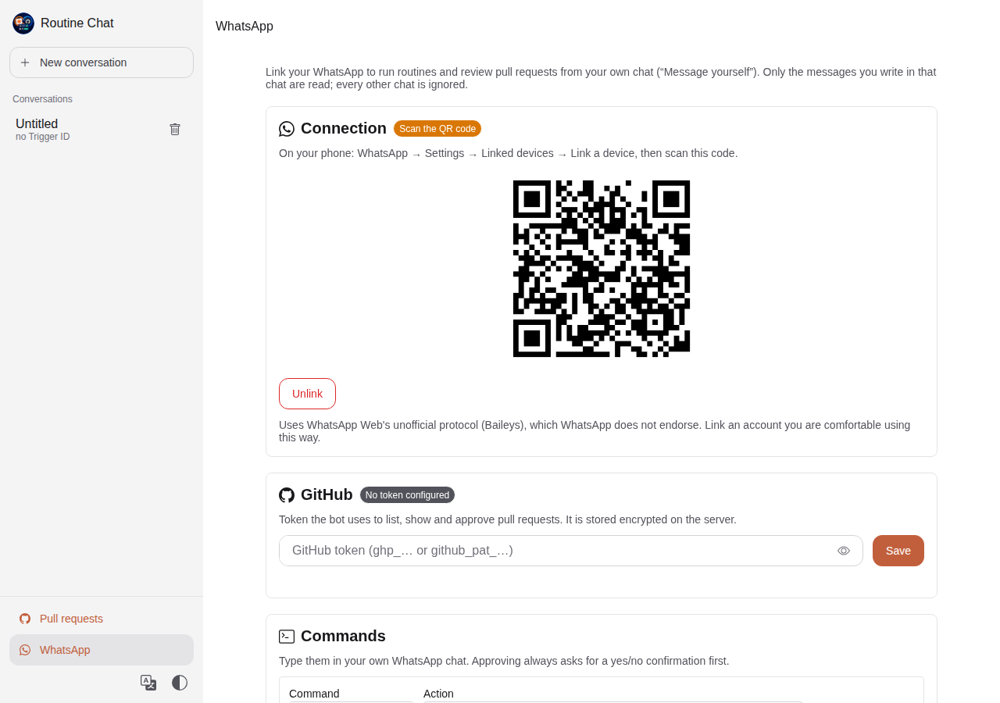
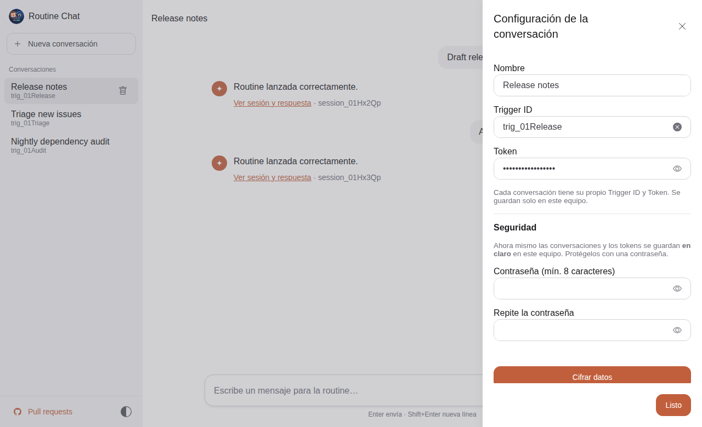
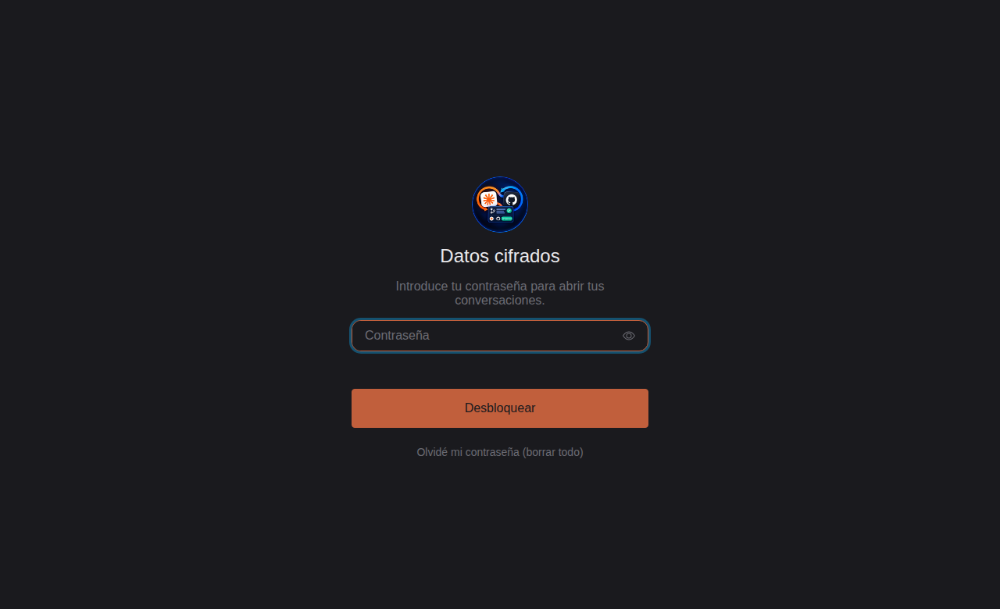
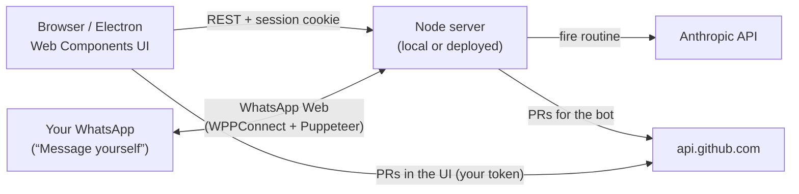

<div align="center">


# Routine Chat

**An open-source chat-style desktop & web client for running Claude Code Routines, reviewing their GitHub pull requests, and controlling them from WhatsApp.**

[](https://www.typescriptlang.org/)
[](https://www.electronjs.org/)
[](https://developer.mozilla.org/docs/Web/API/Web_components)
[](https://shoelace.style)
[](LICENSE)



</div>

---

## Why?

[Claude Code Routines](https://code.claude.com/docs/en/claude-code-on-the-web) can be triggered over HTTP, but doing it by hand means juggling `curl`, trigger IDs, tokens and session links. **Routine Chat** turns that into a familiar chat UI:

- Each **conversation** is bound to one routine (its own trigger ID + token).
- Every message you send **fires the routine** with your text and shows a link to the Claude Code session it started.
- When the routine opens a pull request, you can **review, comment on and approve it** from the same app.

- Link **WhatsApp** and do the same from your phone: `/prs`, `/pr 16`, `/approve 16` (with a yes/no confirmation) or `/fix <task>` to fire a routine.

It runs **on your machine** (desktop app or `localhost`) or on **your own server** with login, encrypted storage and hardened HTTP. Your tokens never touch a third-party service.

## Features

| | |
|---|---|
| 💬 **Chat-style UI** | ChatGPT/Claude-like layout: conversation list on the left, chat on the right. |
| 🗂️ **Multiple routines** | Every conversation has its own trigger ID, token and history. |
| 💾 **Local history** | Conversations are persisted locally (browser / Electron storage). |
| 🔐 **Optional encryption** | Lock your data with a passphrase: PBKDF2-SHA256 + AES-256-GCM via WebCrypto. |
| 📱 **WhatsApp bot** | Scan a QR code and control routines and PRs from your own WhatsApp chat with configurable `/commands`. |
| 🔍 **Pull request review** | See all your open PRs, read descriptions and diffs, then **Approve**, **Request changes** or **Comment**. |
| 🌗 **Light / dark / system theme** | One-click theme toggle, remembered between sessions. |
| 🌍 **4 languages** | English (default), Español, Français and Português, switchable at any time. |
| 🖥️ **Desktop, web or server** | Electron app, browser on `localhost`, or deployed on a server behind HTTPS with login. |
| 🧩 **Zero-framework frontend** | Native Web Components written in TypeScript, styled with [Shoelace](https://shoelace.style). |

## Screenshots

<table>
  <tr>
    <td align="center"><br/><sub><b>Review & approve pull requests</b></sub></td>
    <td align="center"><br/><sub><b>Dark theme</b></sub></td>
  </tr>
  <tr>
    <td align="center" colspan="2"><br/><sub><b>Link WhatsApp with a QR code and configure the bot's commands</b></sub></td>
  </tr>
  <tr>
    <td align="center"><br/><sub><b>Per-conversation trigger & token</b></sub></td>
    <td align="center"><br/><sub><b>Encrypted local data</b></sub></td>
  </tr>
</table>

## Quick start

**Requirements:** Node.js 22.9+ and npm. The WhatsApp bot uses your installed **Google Chrome** (or the Chrome Puppeteer downloads on `npm install`, or `PUPPETEER_EXECUTABLE_PATH`).

```bash
git clone https://github.com/rodrireddev/github-routine-api.git
cd github-routine-api
npm install

npm start          # web: http://localhost:47321
npm run electron   # desktop window (Electron / Chromium)
```

Both commands rebuild the TypeScript sources before starting.

Then:

1. Click **⚙** (top right) and enter a **name**, the routine **Trigger ID** (`trig_…`) and its **token**.
2. Type a message and press **Enter**. The routine fires and you get a link to the Claude Code session it started.
3. Click **New conversation** to add another routine. Each conversation starts empty and has its own credentials.
4. Change the language with the translate button at the bottom of the sidebar (or in **⚙ → Application**).

## How it works



- **Routines from the chat UI:** each message goes to the server, which fires the routine with the conversation's trigger ID and token. The call is made server-side, so browser CORS rules don't get in the way.
- **WhatsApp bot:** the server runs WhatsApp Web in a headless Chrome through [WPPConnect](https://github.com/wppconnect-team/wppconnect) (Puppeteer), linked to your phone with a QR code. It reads the commands you write in your own chat and replies there. The browser profile is kept, so you only scan the QR once.
- **One GitHub token:** it is stored encrypted on the server and shared by the Pull requests view (which calls `api.github.com` from the browser) and the WhatsApp bot.

The request sent to fire a routine is equivalent to:

```bash
curl -X POST https://api.anthropic.com/v1/claude_code/routines/$TRIGGER_ID/fire \
  -H "Authorization: Bearer $ROUTINE_TOKEN" \
  -H "anthropic-beta: experimental-cc-routine-2026-04-01" \
  -H "anthropic-version: 2023-06-01" \
  -H "Content-Type: application/json" \
  -d '{"text": "your message"}'
```

> **Note:** the fire endpoint returns the ID and URL of the Claude Code session it created, not the routine's final output. Routine Chat shows that link so you can follow the session.

## WhatsApp bot

1. Open **WhatsApp** in the sidebar and click **Link WhatsApp**.
2. On your phone go to **WhatsApp → Settings → Linked devices → Link a device**, and scan the QR code.
3. Make sure a **GitHub token** is set. The app uses one token for everything: if you already entered it in Pull requests, the bot uses it too.
4. Open your own chat (**“Message yourself”**) and send `/help`.

### Default commands

| Command | What it does |
|---|---|
| `/help` | Lists the enabled commands. |
| `/prs` | Lists your open pull requests with their numbers. |
| `/pr 16` | Shows PR #16, well formatted: description, branches, stats, files and link. Also accepts `/pr#16`, `/pr repo#16`, `/pr owner/repo#16` or a PR URL. |
| `/approve 16` | Asks **“Approve PR #16 in owner/repo? Reply yes or no”** first. Only `yes` approves; anything else cancels. The confirmation expires after 2 minutes, and the approval is pinned to the commit you were shown. |
| `/routine <task>` | Fires a routine with the rest of the message, e.g. `/routine create a branch from main and fix the login bug`. Disabled until you set its Trigger ID and token. |

Commands ship in English. In **WhatsApp → Commands** you can rename them, disable them, and add as many routine commands as you like (`/fix`, `/docs`, `/release`, each with its own routine). There is a shortcut to copy the trigger ID and token from a chat conversation.

### Safety rules

- **Only your own chat counts.** The bot reads only messages you write in your own chat. Messages from other people and groups are ignored, so nobody else can run commands.
- **Notes stay notes.** Messages that don't start with `/` are ignored, so you can keep using the chat for notes.
- **Approvals always need a yes.** An approval is never executed without an explicit `yes`.
- **No self-approval.** GitHub doesn't allow approving your own PRs. The bot refuses those up front.

> ⚠️ WPPConnect automates WhatsApp Web, which is not an official WhatsApp API and may break when WhatsApp changes. WhatsApp could restrict accounts that automate it. Link an account you are comfortable using this way.

## Reviewing pull requests

Open **Pull requests** at the bottom of the sidebar and paste a GitHub token. The view opens on **★ All my open PRs**. It lists the open PRs from your repos, your organizations, and PRs that involve you or request your review. You can also:

- pick a single repository from the dropdown;
- paste a PR URL (or `owner/repo#123`) to open it directly;
- use **Diagnostics** to see GitHub's raw responses for your token.

Reviews are pinned to the commit you were looking at and ask for confirmation before being sent.

### Which token should I use?

| Token type | Setup | Pros | Cons |
|---|---|---|---|
| **Fine-grained PAT** *(recommended)* | Resource owner = you (or your org). Repository access = the repos to review. Permissions: **Pull requests: Read and write**, **Contents: Read-only**. | Least privilege: limited to the repos and permissions you choose. | GitHub has no API to list "the repos this token can access". Private repos the token wasn't granted return **404**. |
| **Classic PAT** | Scope **`repo`**. Use a short expiration. | Sees every private repo your user can access. Works out of the box. | Broad access to all your repositories. |

> GitHub does not allow approving (or requesting changes on) **your own** pull requests. Routine Chat disables those buttons on PRs authored by the token's user.

## Security & privacy

- **Local by default.** The server listens on `127.0.0.1`. Exposing it requires server mode (see [Deploying to a server](#deploying-to-a-server)).
- **Plain storage by default.** Conversations, trigger IDs and tokens are stored in your local browser/Electron storage.
- **Optional encryption.** In **⚙ → Security**, set a passphrase:
  - A key is derived with **PBKDF2-SHA256** (600,000 iterations, random salt).
  - Data is encrypted with **AES-256-GCM** (WebCrypto).
  - Only the encrypted vault remains on disk, and the app asks for the passphrase at startup.
  - **🔒** locks the app instantly.
  - There is **no recovery** if you forget the passphrase.
- Encryption protects data **at rest**. While unlocked, tokens live in memory so the app can use them.
- Untrusted content from GitHub (titles, descriptions, diffs) is always rendered as text, never as HTML.

See [SECURITY.md](SECURITY.md) to report a vulnerability.

## Configuration

You can change everything from the UI. The server reads optional settings from a `.env` file (copy [`.env.example`](.env.example)):

| Variable | Description | Default |
|---|---|---|
| `HOST` | Interface to listen on. Any non-loopback value (e.g. `0.0.0.0`) switches to **server mode**. | `127.0.0.1` |
| `PORT` | HTTP port. Keep it fixed: browser storage is per origin. | `47321` |
| `ADMIN_PASSWORD` | Enables the login screen (min. 12 characters). **Required in server mode.** | – |
| `APP_SECRET` | Encrypts server-side data and protects sessions (min. 32 characters). **Required in server mode**; generated automatically in local mode. | auto |
| `DATA_DIR` | Where the encrypted bot settings and the WhatsApp session are stored. | `./data` |
| `TRUST_PROXY` | Set to `true` behind a reverse proxy that terminates HTTPS. The app then honours `X-Forwarded-Proto`/`For` (secure cookies, HSTS, per-IP limits). | `false` |
| `WHATSAPP_ENABLED` | Set to `false` to disable the WhatsApp bot. | `true` |
| `PUPPETEER_EXECUTABLE_PATH` | Chrome/Chromium used for WhatsApp Web. If empty, the installed Google Chrome is used, then the one Puppeteer downloads. | – |
| `ROUTINE_TRIGGER_ID` / `ROUTINE_TOKEN` | Fallback routine for chat conversations without their own. | – |

## Deploying to a server

Server mode is designed for a small VPS or container that **you** control.

```bash
HOST=0.0.0.0 \
ADMIN_PASSWORD='a long passphrase' \
APP_SECRET="$(openssl rand -hex 32)" \
TRUST_PROXY=true \
npm start
```

Or with Docker (Chromium included):

```bash
docker build -t routine-chat .
docker run -d --name routine-chat -p 127.0.0.1:47321:47321 \
  -e ADMIN_PASSWORD='a long passphrase' -e APP_SECRET="$(openssl rand -hex 32)" -e TRUST_PROXY=true \
  -v routine-chat-data:/data routine-chat
```

**Put it behind HTTPS.** Use a reverse proxy such as Caddy, nginx or Traefik, and only publish the port on `127.0.0.1`.

**What server mode enforces:**

- **Safe startup:** the server refuses to start without `ADMIN_PASSWORD` and `APP_SECRET`.
- **Login:**
  - Sessions are server-side, in `HttpOnly` + `SameSite=Strict` cookies, and are `Secure` over HTTPS.
  - Login attempts are rate-limited (10 per 15 minutes per IP).
  - The password check is constant-time.
- **CSRF protection:** writes must be JSON from the same origin.
- **Security headers:**
  - A strict Content-Security-Policy with no inline scripts.
  - `X-Frame-Options: DENY`, `nosniff`, `no-referrer`, and HSTS over HTTPS.
- **Limits:** API rate limiting, request-body size limits and request timeouts.
- **Secrets at rest:** the bot settings (GitHub token, routine tokens) are encrypted with AES-256-GCM, using a key derived from `APP_SECRET`. Tokens are never sent back to the browser.
- **WhatsApp session:**
  - The session lives in `DATA_DIR/whatsapp-session`, with `0700` permissions.
  - Anyone with that folder can use the linked WhatsApp, so back it up and protect it accordingly.

## Project structure

The code is organised by responsibility. The bot's logic depends on small interfaces (ports), so WhatsApp, GitHub and Anthropic are plain adapters that can be swapped or faked in tests.

```
src/
├── shared/                  # Used by both the server and the browser
│   ├── commands.ts          # Command model, defaults, parsers, validation
│   └── github-api.ts        # GitHub REST client (fetch-only, cached, typed errors)
├── server/
│   ├── main.ts              # CLI entry point (npm start)
│   ├── config.ts            # Env config + local/server mode rules
│   ├── app.ts               # Composition root: wires services, bot and HTTP
│   ├── http/                # Router, auth/sessions, security headers, CSRF, rate limits, static files
│   │   └── routes/          # auth, routines, WhatsApp + bot settings
│   ├── bot/                 # Command bot: ports, use cases, WhatsApp message formatting
│   ├── services/            # Routine firing, bot settings (validation, secret masking)
│   ├── infrastructure/      # Adapters: WhatsApp (WPPConnect), GitHub, encrypted file store
│   └── __tests__/           # node:test suites
├── electron/main.ts         # Desktop wrapper (local mode)
└── client/                  # Browser UI (Web Components, compiled to public/js)
    ├── main.ts              # Chooses login / lock screen / app
    ├── core/                # i18n, theme, local store + encryption, API client, DOM helper
    ├── services/github.ts   # GitHub access for the UI (translated errors, repo discovery)
    └── components/          # routine-chat, conversation-list, chat-*, lock/login screens,
        ├── pull-requests/   #   PR review view, its dialogs and preferences
        └── whatsapp/        #   WhatsApp panel (QR, GitHub token, command editor)
```

### Scripts

| Command | What it does |
|---|---|
| `npm start` | Build everything and start the server |
| `npm run electron` | Build everything and open the desktop app |
| `npm test` | Build the server and run the test suite (`node:test`) |
| `npm run build` | Compile server (`dist/`) and client (`public/js/`) |

## Roadmap & known limitations

- [ ] Show the routine's final output in the chat (the fire endpoint only returns the session link)
- [ ] Packaged desktop installers (Windows / macOS / Linux)
- [ ] Inline review comments on specific diff lines
- [ ] More bot commands (request changes, merge, routine status)
- Fine-grained tokens can't enumerate their own repositories (a GitHub API limitation). See [Which token should I use?](#which-token-should-i-use)

## Contributing

Contributions are welcome! Read [CONTRIBUTING.md](CONTRIBUTING.md) to get started.

## License

[MIT](LICENSE) © rodrireddev

---

<sub>Routine Chat is an independent open-source project. It is not affiliated with, endorsed by, or sponsored by Anthropic or GitHub. "Claude" and "GitHub" are trademarks of their respective owners.</sub>
