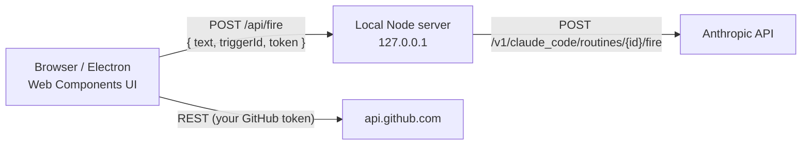

<div align="center">


# Routine Chat

**A local, chat-style desktop & web client for firing Claude Code Routines and reviewing the GitHub pull requests they produce.**

[](https://www.typescriptlang.org/)
[](https://www.electronjs.org/)
[](https://developer.mozilla.org/docs/Web/API/Web_components)
[](https://shoelace.style)
[](LICENSE)


</div>

---

## Why?

[Claude Code Routines](https://code.claude.com/docs/en/claude-code-on-the-web) can be triggered over HTTP, but doing it by hand means juggling `curl`, trigger IDs, tokens and session links. **Routine Chat** turns that into a familiar chat UI:

- Each **conversation** is bound to one routine (its own trigger ID + token).
- Every message you send **fires the routine** with your text and shows a link to the Claude Code session it started.
- When the routine opens a pull request, you can **review, comment on and approve it** from the same app.

Everything runs **on your machine**. Your tokens never touch a third-party server.

## Features

| | |
|---|---|
| 💬 **Chat-style UI** | ChatGPT/Claude-like layout: conversation list on the left, chat on the right. |
| 🗂️ **Multiple routines** | Every conversation has its own trigger ID, token and history. |
| 💾 **Local history** | Conversations are persisted locally (browser / Electron storage). |
| 🔐 **Optional encryption** | Lock your data with a passphrase: PBKDF2-SHA256 + AES-256-GCM via WebCrypto. |
| 🔍 **Pull request review** | See all your open PRs, read descriptions and diffs, then **Approve**, **Request changes** or **Comment**. |
| 🌗 **Light / dark / system theme** | One-click theme toggle, remembered between sessions. |
| 🌍 **4 languages** | English (default), Español, Français and Português, switchable at any time. |
| 🖥️ **Desktop app** | Ships as an Electron app, or runs in any browser on `localhost`. |
| 🧩 **Zero-framework frontend** | Native Web Components written in TypeScript, styled with [Shoelace](https://shoelace.style). |

## Screenshots

<table>
  <tr>
    <td align="center"><br/><sub><b>Review & approve pull requests</b></sub></td>
    <td align="center"><br/><sub><b>Dark theme</b></sub></td>
  </tr>
  <tr>
    <td align="center"><br/><sub><b>Per-conversation trigger & token</b></sub></td>
    <td align="center"><br/><sub><b>Encrypted local data</b></sub></td>
  </tr>
</table>

## Quick start

**Requirements:** Node.js 22.9+ and npm.

```bash
git clone https://github.com/rodrireddev/github-routine-api.git
cd github-routine-api
npm install

npm start          # web: http://localhost:3000
npm run electron   # desktop window (Electron / Chromium)
```

Both commands rebuild the TypeScript sources before starting.

Then:

1. Click **⚙** (top right) and enter a **name**, the routine **Trigger ID** (`trig_…`) and its **token**.
2. Type a message and press **Enter**. The routine fires and you get a link to the Claude Code session it started.
3. Click **New conversation** to add another routine. Each conversation starts empty and has its own credentials.
4. Change the language with the translate button at the bottom of the sidebar (or in **⚙ → Application**).

## How it works



- **Routines:** the UI sends each message to a tiny local server (bound to `127.0.0.1`). The server forwards it to the Anthropic API using the conversation's trigger ID and token. The request is made server-side so that browser CORS rules don't get in the way.
- **GitHub:** pull request calls go **directly** from the UI to `api.github.com`. They never pass through the local server.

The request sent for every message is equivalent to:

```bash
curl -X POST https://api.anthropic.com/v1/claude_code/routines/$TRIGGER_ID/fire \
  -H "Authorization: Bearer $ROUTINE_TOKEN" \
  -H "anthropic-beta: experimental-cc-routine-2026-04-01" \
  -H "anthropic-version: 2023-06-01" \
  -H "Content-Type: application/json" \
  -d '{"text": "your message"}'
```

> **Note:** the fire endpoint returns the ID and URL of the Claude Code session it created, not the routine's final output. Routine Chat shows that link so you can follow the session.

## Reviewing pull requests

Open **Pull requests** at the bottom of the sidebar and paste a GitHub token. The view opens on **★ All my open PRs**. It lists the open PRs from your repos, your organizations, and PRs that involve you or request your review. You can also:

- pick a single repository from the dropdown;
- paste a PR URL (or `owner/repo#123`) to open it directly;
- use **Diagnostics** to see GitHub's raw responses for your token.

Reviews are pinned to the commit you were looking at and ask for confirmation before being sent.

### Which token should I use?

| Token type | Setup | Pros | Cons |
|---|---|---|---|
| **Fine-grained PAT** *(recommended)* | Resource owner = you (or your org). Repository access = the repos to review. Permissions: **Pull requests: Read and write**, **Contents: Read-only**. | Least privilege: limited to the repos and permissions you choose. | GitHub has no API to list "the repos this token can access". Private repos the token wasn't granted return **404**. |
| **Classic PAT** | Scope **`repo`**. Use a short expiration. | Sees every private repo your user can access. Works out of the box. | Broad access to all your repositories. |

> GitHub does not allow approving (or requesting changes on) **your own** pull requests. Routine Chat disables those buttons on PRs authored by the token's user.

## Security & privacy

- **Local only.** The server listens on `127.0.0.1` and only forwards routine calls to `api.anthropic.com`. GitHub calls go straight to `api.github.com`.
- **Plain storage by default.** Conversations, trigger IDs and tokens are stored in your local browser/Electron storage.
- **Optional encryption.** In **⚙ → Security**, set a passphrase:
  - A key is derived with **PBKDF2-SHA256** (600,000 iterations, random salt).
  - Data is encrypted with **AES-256-GCM** (WebCrypto).
  - Only the encrypted vault remains on disk, and the app asks for the passphrase at startup.
  - **🔒** locks the app instantly.
  - There is **no recovery** if you forget the passphrase.
- Encryption protects data **at rest**. While unlocked, tokens live in memory so the app can use them.
- Untrusted content from GitHub (titles, descriptions, diffs) is always rendered as text, never as HTML.

See [SECURITY.md](SECURITY.md) to report a vulnerability.

## Configuration

All settings can be made from the UI. Optional defaults can live in a `.env` file (copy [`.env.example`](.env.example)):

| Variable | Description | Default |
|---|---|---|
| `ROUTINE_TRIGGER_ID` | Fallback trigger ID, used when a conversation has none | – |
| `ROUTINE_TOKEN` | Fallback routine token | – |
| `PORT` | Local server port. Keep it fixed: browser storage is per origin, so changing it starts with empty storage. | `3000` |

## Project structure

```
src/
├── app.ts                  # Local HTTP server: static files + /api/fire proxy
├── server.ts               # CLI entry point (npm start)
├── electron/main.ts        # Electron entry point (npm run electron)
└── client/                 # Frontend (Web Components, compiled to /public)
    ├── routine-chat.ts     # <routine-chat>: app shell, chat view
    ├── conversation-list.ts# <conversation-list>: sidebar
    ├── chat-message.ts     # <chat-message>: message bubble
    ├── chat-settings.ts    # <chat-settings>: per-conversation settings + security
    ├── pr-review.ts        # <pr-review>: GitHub pull request review
    ├── lock-screen.ts      # <lock-screen>: passphrase prompt
    ├── store.ts            # Local persistence (plain or encrypted)
    ├── crypto.ts           # PBKDF2 + AES-GCM helpers
    ├── github.ts           # Minimal GitHub REST client
    ├── theme.ts            # Light / dark / system theme
    └── i18n.ts             # UI translations (en, es, fr, pt)
public/                     # index.html, assets, compiled client JS
docs/screenshots/           # README images
```

### Scripts

| Command | What it does |
|---|---|
| `npm start` | Build everything and start the web server |
| `npm run electron` | Build everything and open the desktop app |
| `npm run build` | Compile server (`dist/`) and client (`public/*.js`) |

## Roadmap & known limitations

- [ ] Show the routine's final output in the chat (the fire endpoint only returns the session link)
- [ ] Packaged desktop installers (Windows / macOS / Linux)
- [ ] Inline review comments on specific diff lines
- Fine-grained tokens can't enumerate their own repositories (a GitHub API limitation). See [Which token should I use?](#which-token-should-i-use)

## Contributing

Contributions are welcome! Read [CONTRIBUTING.md](CONTRIBUTING.md) to get started.

## License

[MIT](LICENSE) © rodrireddev

---

<sub>Routine Chat is an independent open-source project. It is not affiliated with, endorsed by, or sponsored by Anthropic or GitHub. "Claude" and "GitHub" are trademarks of their respective owners.</sub>
